# Frontend UI 시스템 흐름 정리

Common UI 플러그인 기반으로 구성된 Frontend UI 시스템의 전체 구조와 흐름입니다.

---

## 클래스 구조 한눈에 보기

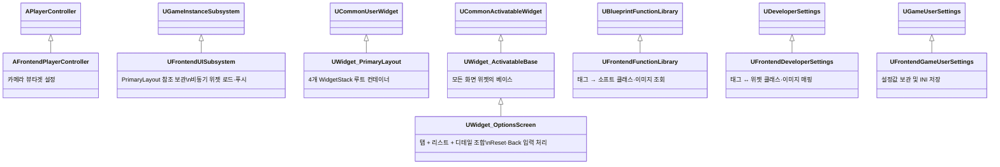

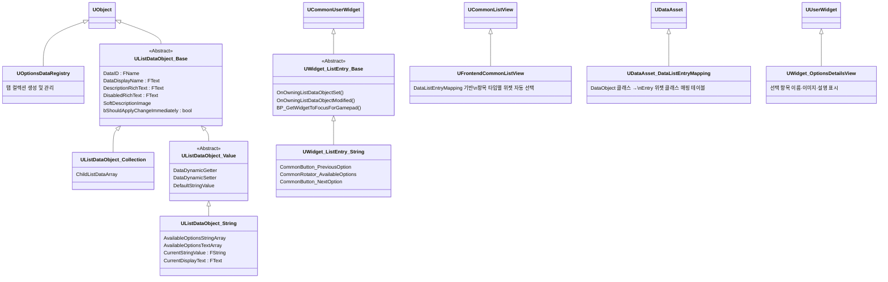

---

## 게임플레이 태그 체계

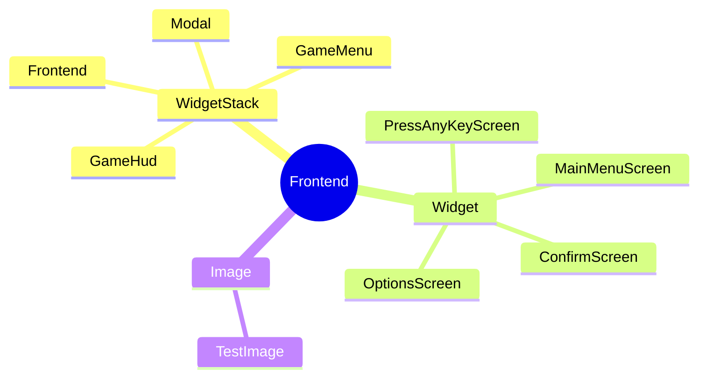

- `WidgetStack` 태그 → **어느 스택에 넣을지** 결정
- `Widget` 태그 → **어떤 위젯 클래스를 로드할지** 결정
- `Image` 태그 → **옵션 항목 설명 이미지**를 `UFrontendDeveloperSettings`에서 조회할 때 사용

---

## 에디터 설정 (FrontendDeveloperSettings)

`프로젝트 설정 > Frontend UI Settings`에서 태그와 위젯 클래스를 매핑합니다.

```
FrontendWidgetMap
├── Frontend.Widget.PressAnyKeyScreen  →  BP_Widget_PressAnyKey   (소프트 레퍼런스)
├── Frontend.Widget.MainMenuScreen     →  BP_Widget_MainMenu       (소프트 레퍼런스)
└── Frontend.Widget.OptionsScreen      →  BP_Widget_OptionsScreen  (소프트 레퍼런스)

OptionsScreenSoftImageMap
└── Frontend.Image.TestImage           →  T_SomeTexture2D          (소프트 레퍼런스)
```

소프트 레퍼런스이기 때문에 실제 에셋은 **필요한 시점에 비동기 로드**됩니다.

---

## 전체 초기화 흐름

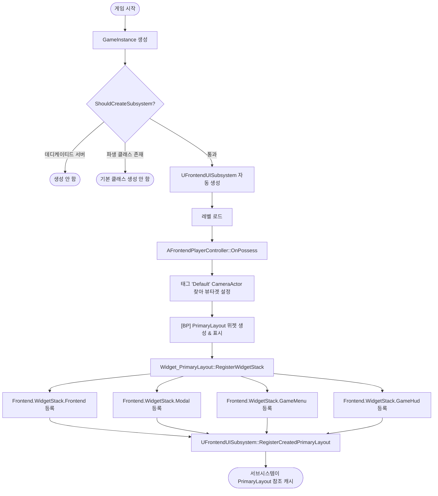

---

## 위젯 푸시 흐름

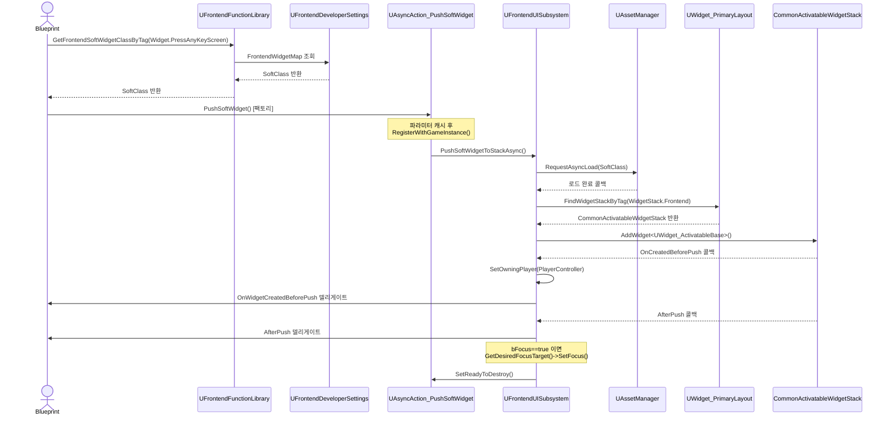

---

## 옵션 화면 생성 흐름

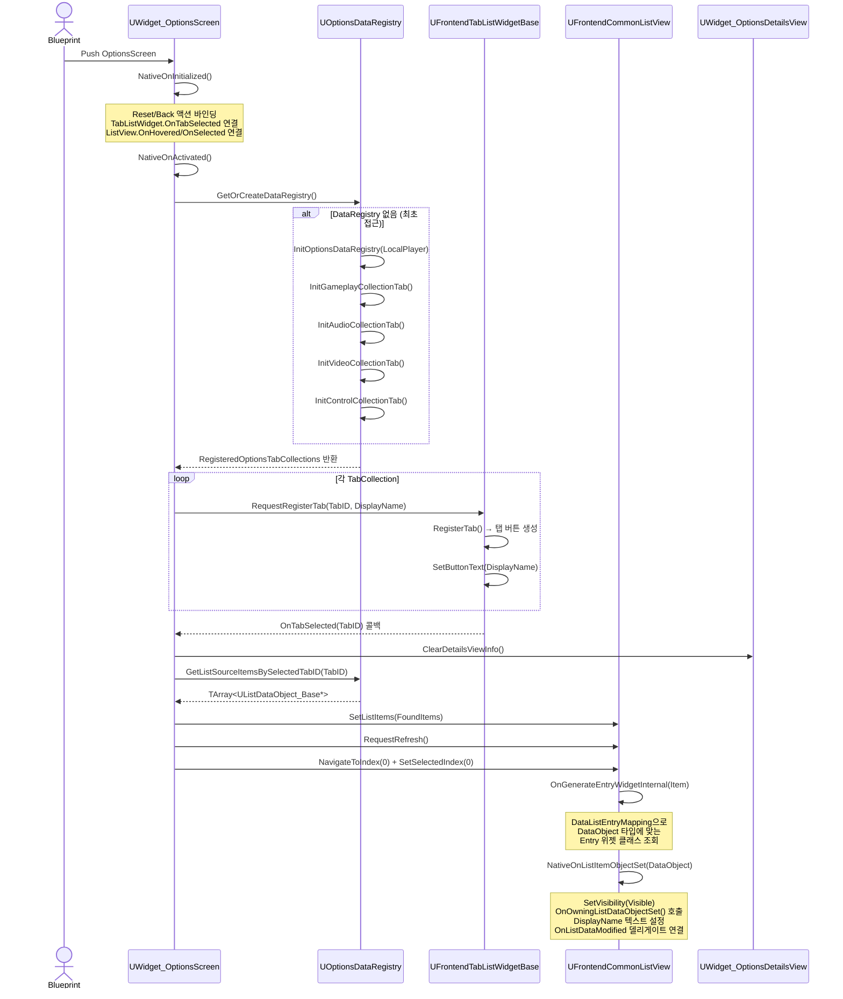

---

## 옵션 데이터 시스템 구조

### Data Object 계층

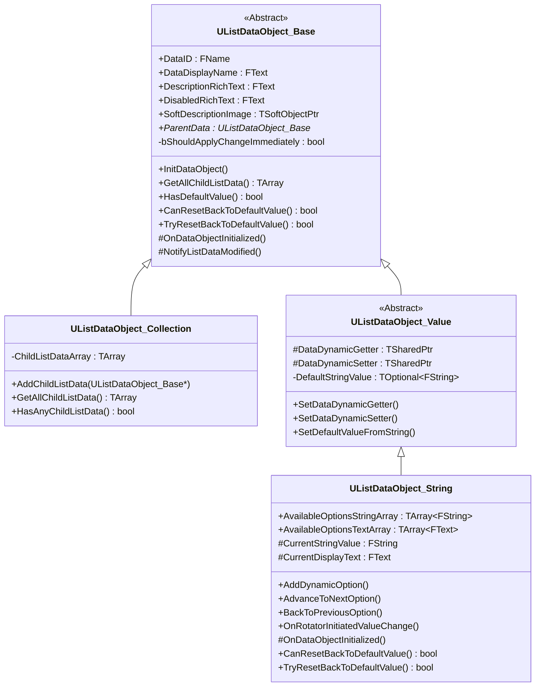

### Collection과 Entry 관계

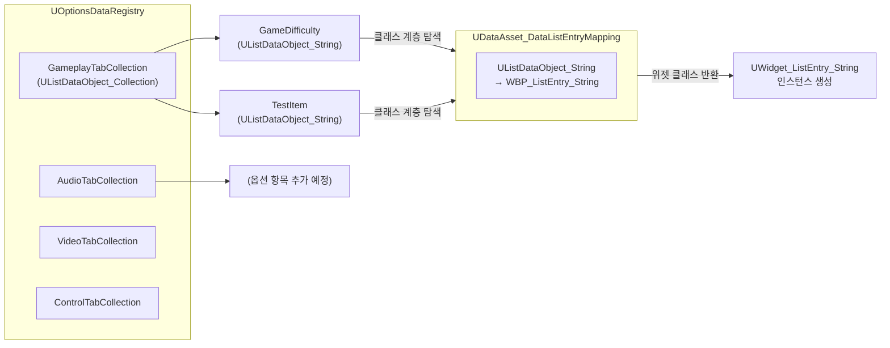

### 값 저장/로드 흐름

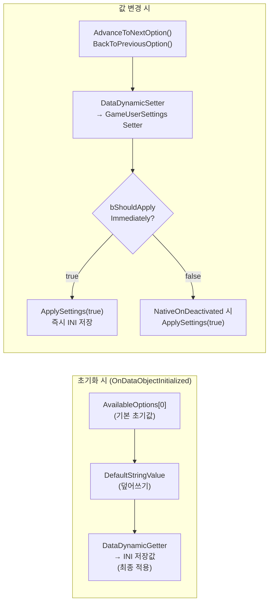

### FOptionsDataInteractionHelper 구조

```
MAKE_OPTIONS_DATA_CONTROL(GetCurrentGameDifficulty)
    └─ MakeShared<FOptionsDataInteractionHelper>(
           GET_FUNCTION_NAME_STRING_CHECKED(UFrontendGameUserSettings, GetCurrentGameDifficulty))
    └─ FCachedPropertyPath로 함수 경로 캐시
    └─ GetValueAsString() / SetValueFromString()
           → UFrontendGameUserSettings 인스턴스의 Getter/Setter 리플렉션 호출
```

`UFrontendGameUserSettings`의 Getter/Setter는 반드시 `UFUNCTION()`으로 마킹되어야 합니다.  
`FCachedPropertyPath`가 리플렉션 시스템을 통해 함수를 호출하기 때문입니다.

---

## 옵션 탭(Tab) 추가 방법

### 작업 절차

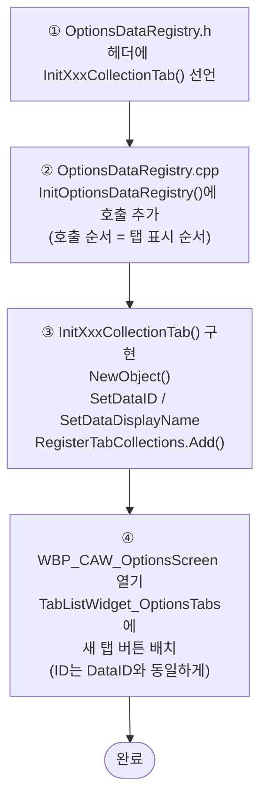

**코드 예시:**

```cpp
// OptionsDataRegistry.h — 선언 추가
void InitAccessibilityCollectionTab();

// OptionsDataRegistry.cpp — 호출 추가
void UOptionsDataRegistry::InitOptionsDataRegistry(ULocalPlayer* InOwningLocalPlayer)
{
    InitGameplayCollectionTab();
    InitAudioCollectionTab();
    InitVideoCollectionTab();
    InitControlCollectionTab();
    InitAccessibilityCollectionTab(); // ← 표시 순서 = 호출 순서
}

// 구현
void UOptionsDataRegistry::InitAccessibilityCollectionTab()
{
    UListDataObject_Collection* Tab = NewObject<UListDataObject_Collection>();
    Tab->SetDataID(FName("AccessibilityTabCollection")); // ← 고유 ID (중복 불가)
    Tab->SetDataDisplayName(FText::FromString(TEXT("접근성")));

    // 하위 옵션 항목을 AddChildListData()로 추가...

    RegisteredOptionsTabCollections.Add(Tab);
}
```

### 누락 시 발생하는 문제

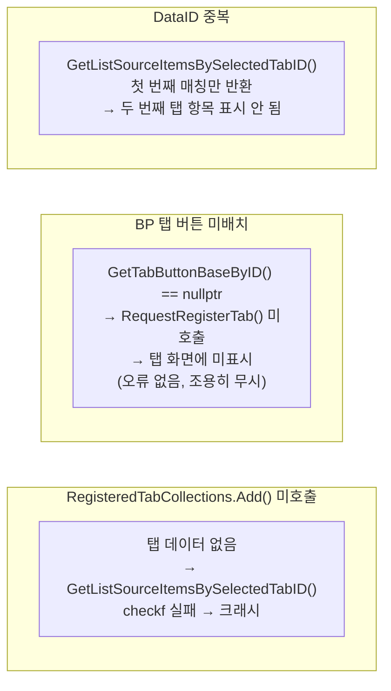

---

## 탭 하위 옵션(Entry) 추가 방법

### 작업 절차

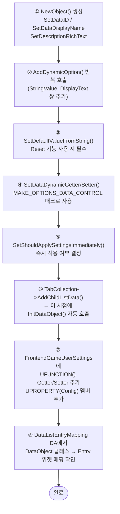

**코드 예시:**

```cpp
// ① ~ ⑥ OptionsDataRegistry.cpp
UListDataObject_String* MyOption = NewObject<UListDataObject_String>();
MyOption->SetDataID(FName("MyOption"));
MyOption->SetDataDisplayName(FText::FromString(TEXT("새 옵션")));
MyOption->SetDescriptionRichText(FText::FromString(TEXT("옵션 설명 Rich Text")));

MyOption->AddDynamicOption(TEXT("Value1"), FText::FromString(TEXT("옵션 1")));
MyOption->AddDynamicOption(TEXT("Value2"), FText::FromString(TEXT("옵션 2")));

MyOption->SetDefaultValueFromString(TEXT("Value1"));
MyOption->SetDataDynamicGetter(MAKE_OPTIONS_DATA_CONTROL(GetMyOptionValue));
MyOption->SetDataDynamicSetter(MAKE_OPTIONS_DATA_CONTROL(SetMyOptionValue));
MyOption->SetShouldApplySettingsImmediately(true);

SomeTabCollection->AddChildListData(MyOption); // ← 마지막에 호출
```

```cpp
// ⑦ FrontendGameUserSettings.h
UFUNCTION()  // ← 필수 (FCachedPropertyPath 리플렉션)
FString GetMyOptionValue() const { return MyOptionValue; }

UFUNCTION()
void SetMyOptionValue(const FString& InValue) { MyOptionValue = InValue; }

UPROPERTY(Config)  // ← INI 저장 필수
FString MyOptionValue;
```

### Entry Widget 매핑 탐색 방식

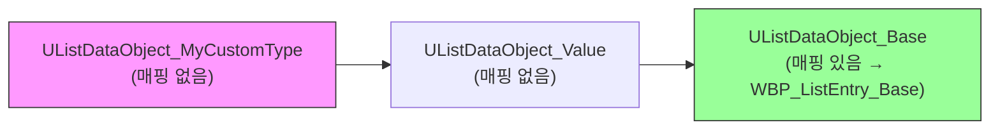

정확한 타입에 매핑이 없으면 **부모 클래스로 순차 탐색**하여 폴백 위젯을 사용합니다.  
클래스 계층 전체에 매핑이 없으면 위젯 생성 실패입니다.

---

## CommonUI 포커스 및 네비게이션

### 게임패드 포커스 이동 흐름

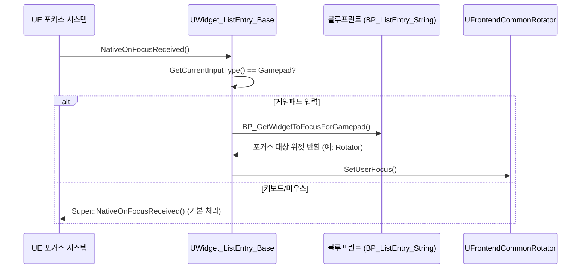

### 탭 전환 시 포커스 처리

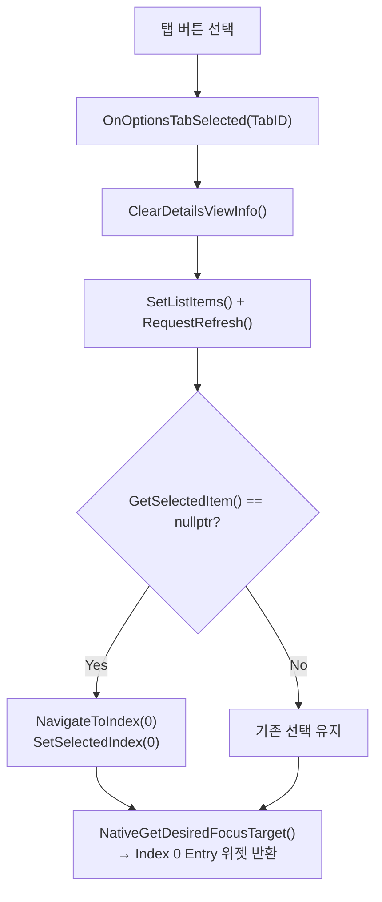

### 포커스 관련 버그가 발생하기 쉬운 부분

| 상황 | 증상 | 원인 |
|---|---|---|
| 새 Entry 위젯 추가 후 게임패드 조작 불가 | 포커스가 Entry 내부 위젯으로 전달 안 됨 | `BP_GetWidgetToFocusForGamepad()` 블루프린트 미구현 |
| 로테이터 클릭해도 리스트 선택 안 됨 | ListView 선택 상태 미변경 | `OnClicked()`에서 `SelectThisEntryWidget()` 미호출 |
| Entry 위젯 재사용 시 표시 안 됨 | 아이템이 보이지 않음 | `NativeOnListItemObjectSet()`의 `SetVisibility(Visible)` 누락 |
| 탭 전환 후 디테일 패널 이전 정보 잔류 | 이전 항목 설명이 남음 | `OnOptionsTabSelected()` 시작 시 `ClearDetailsViewInfo()` 미호출 |

---

## 개발 시 유의사항

### "Invalid Option"이 표시되는 원인

```mermaid
flowchart TD
    A["UListDataObject_String::OnDataObjectInitialized()"] --> B["TrySetDisplayTextFromStringValue(CurrentStringValue)"]
    B --> C{"AvailableOptionsStringArray에\n해당 값이 있는가?"}
    C -- Yes --> D["CurrentDisplayText 정상 설정"]
    C -- No --> E["CurrentDisplayText =\nFText::FromString('Invalid Option')"]

    subgraph 주요 원인
        X1["AddDynamicOption() 전에\nAddChildListData() 호출\n← InitDataObject()가 먼저 실행됨"]
        X2["DefaultStringValue 오타\n또는 대소문자 불일치"]
        X3["DataDynamicGetter 반환값이\nAvailableOptions에 없음"]
    end
    E -.-> 주요 원인
```

**올바른 호출 순서:**

```cpp
// ❌ 잘못된 순서
SomeTab->AddChildListData(MyOption);  // InitDataObject() 여기서 호출 → 옵션 배열 비어있음
MyOption->AddDynamicOption(...);       // 너무 늦음 → "Invalid Option"

// ✅ 올바른 순서
MyOption->AddDynamicOption(TEXT("Easy"), ...);
MyOption->SetDefaultValueFromString(TEXT("Easy"));
MyOption->SetDataDynamicGetter(...);
SomeTab->AddChildListData(MyOption);  // 마지막에 호출 → InitDataObject() 정상 실행
```

### Data Asset 누락 시 발생하는 문제

| 누락 항목 | 에디터 증상 | 런타임 증상 |
|---|---|---|
| `UFrontendCommonListView::DataListEntryMapping` 미설정 | 컴파일 시 에러 로그 | 항목 위젯 생성 안 됨 |
| `UFrontendTabListWidgetBase::TabButtonEntryWidgetClass` 미설정 | 컴파일 에러: `"유효한 항목이 지정되어 있지 않습니다"` | 탭 버튼 생성 안 됨 → 탭 선택 불가 |
| `OptionsScreenSoftImageMap` 미등록 이미지 태그 | 없음 | 설명 이미지 Collapsed 표시 |
| `FrontendWidgetMap` 미등록 위젯 태그 | 없음 | `GetFrontendSoftWidgetClassByTag()` 빈 포인터 반환 |

### `UFUNCTION()` 누락 시 동작

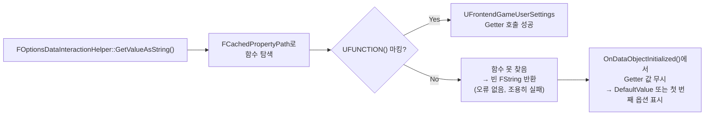

### `bShouldApplySettingsImmediately` 관련 주의

| 설정값 | 동작 | 적합한 옵션 타입 |
|---|---|---|
| `true` | 값 변경마다 `ApplySettings(true)` 호출 (즉시 INI 저장) | 난이도, 언어 등 즉시 반영 필요 항목 |
| `false` (기본) | 화면 닫을 때 `NativeOnDeactivated()`에서 일괄 저장 | 그래픽 품질, 해상도 등 빈번한 저장이 비효율적인 항목 |

---

## 요약 — 핵심 역할 분담

| 클래스 | 역할 |
|---|---|
| `AFrontendPlayerController` | 카메라 뷰타겟 설정 |
| `UFrontendUISubsystem` | PrimaryLayout 참조 보관, 비동기 위젯 로드·푸시 |
| `UWidget_PrimaryLayout` | 4개 WidgetStack의 루트 컨테이너, 태그로 스택 관리 |
| `UWidget_ActivatableBase` | 개별 화면 위젯의 베이스 (PressAnyKey, MainMenu 등이 상속) |
| `UWidget_OptionsScreen` | 탭 리스트 + 옵션 리스트 + 디테일 패널 조합, Reset/Back 입력 처리 |
| `UOptionsDataRegistry` | 탭 컬렉션 생성 및 관리 (지연 초기화, 최초 접근 시 생성) |
| `UListDataObject_Collection` | 탭 데이터 (자식 항목 배열 보유) |
| `UListDataObject_String` | 문자열 선택형 옵션 항목 데이터 |
| `UFrontendCommonListView` | DataListEntryMapping으로 항목 타입별 위젯 자동 선택 |
| `UFrontendTabListWidgetBase` | 탭 버튼 목록 위젯 (`RequestRegisterTab()`으로 탭 등록) |
| `UWidget_ListEntry_Base` | 리스트 항목 위젯 베이스 (DataObject 연결, 포커스 처리) |
| `UWidget_ListEntry_String` | 이전/다음 버튼 + 로테이터로 문자열 값 순환 선택 |
| `UWidget_OptionsDetailsView` | 선택/호버 항목의 이름·이미지·설명 표시 패널 |
| `UDataAsset_DataListEntryMapping` | DataObject 클래스 → Entry 위젯 클래스 매핑 테이블 |
| `FOptionsDataInteractionHelper` | GameUserSettings Getter/Setter를 리플렉션으로 래핑 |
| `UFrontendGameUserSettings` | 설정값 런타임 보관 및 INI 저장 (`UGameUserSettings` 상속) |
| `UAsyncAction_PushSoftWidget` | 블루프린트에서 비동기 푸시를 노드 하나로 사용 가능하게 래핑 |
| `UFrontendFunctionLibrary` | 태그 → 소프트 클래스/이미지 조회 헬퍼 |
| `UFrontendDeveloperSettings` | 에디터에서 태그↔위젯 클래스·이미지 매핑 테이블 |

---

## 현재까지 구현된 화면 전환

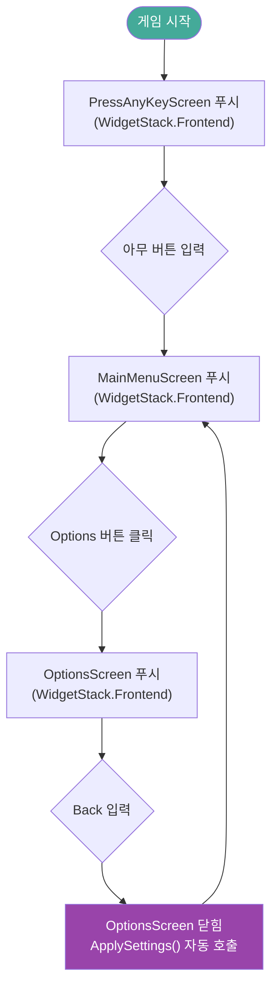

`CommonActivatableWidgetStack`은 스택 구조이므로 MainMenuScreen이 푸시되면  
PressAnyKeyScreen 위에 쌓이고, MainMenuScreen이 닫히면 자동으로 PressAnyKeyScreen으로 돌아옵니다.
